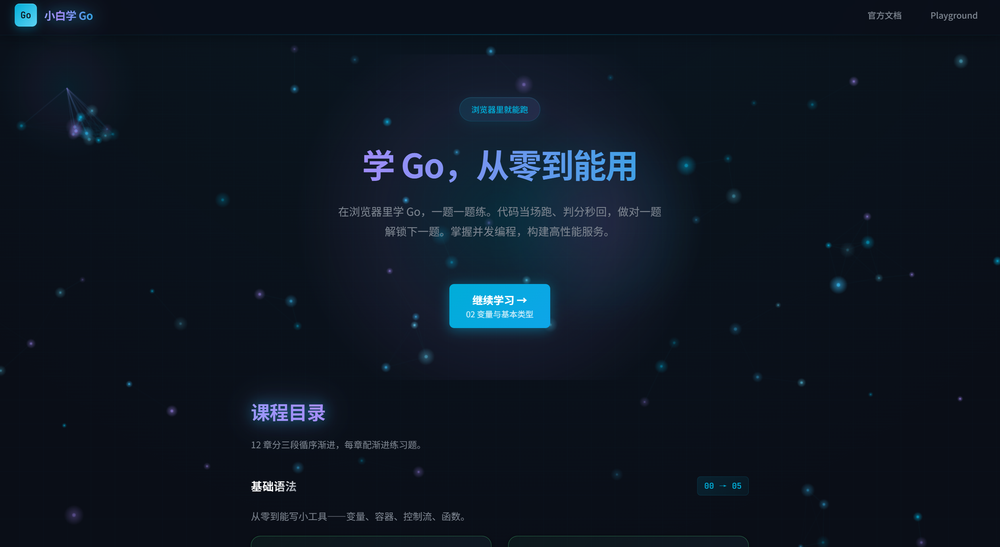
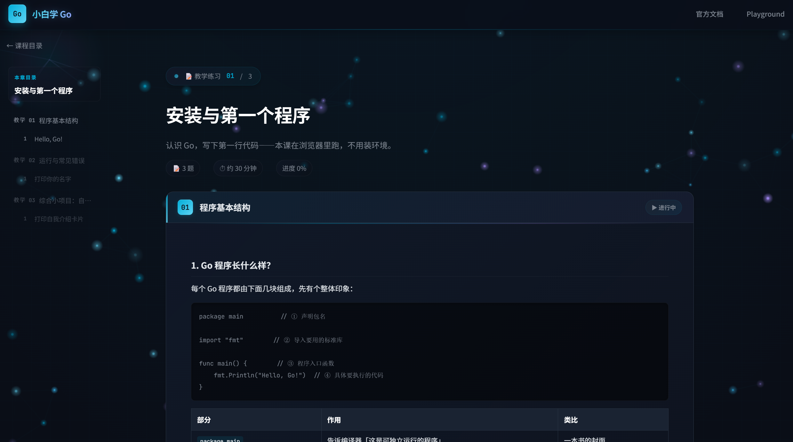
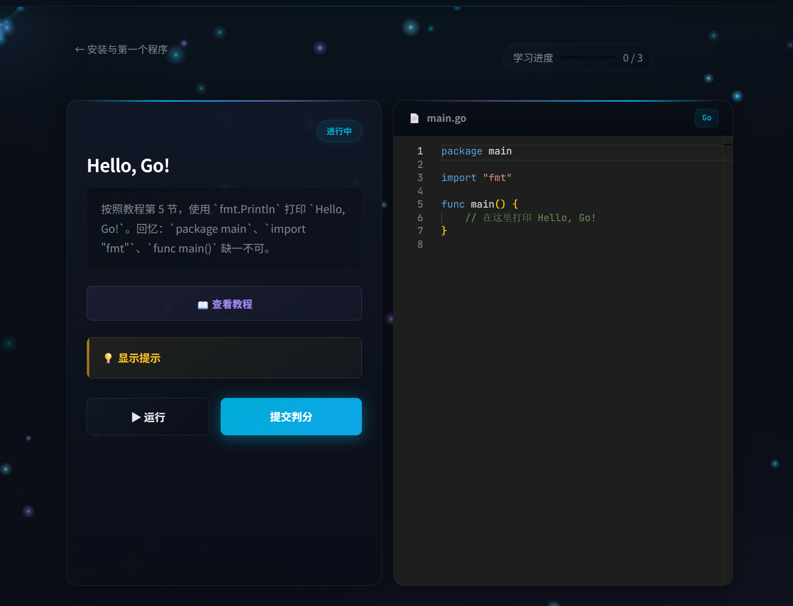

# <div align="center">小白学 Go</div>

<div align="center">

🚀 **从零到能用，浏览器里学 Go 语言** — 交互式编程练习，代码当场跑，判分秒回

[✨ 特色功能](#-特色功能) · [🚀 快速开始](#-快速开始) · [📖 课程大纲](#-课程大纲) · [🛠️ 技术栈](#️-技术栈)

</div>

---

## 📸 截图演示



*精美的首页，粒子动画背景，呼吸灯标题效果*

---

## ✨ 特色功能

### 🎮 沉浸式学习体验
- **Monaco 代码编辑器** — VS Code 同款，语法高亮、自动补全
- **实时代码运行** — 一键运行，沙箱环境执行 `go run`
- **自动判分系统** — stdout 精确比对，秒出结果
- **渐进式解锁** — 做对一题解锁下一题，循序渐进
- **本地进度保存** — localStorage 持久化学习进度

### 🎨 精美视觉效果
- **深色主题** — 护眼暗色风格，专业编程体验
- **粒子背景动画** — 跟随鼠标的流动粒子效果
- **呼吸灯效果** — 标题与按钮的动态光晕
- **打字机输出** — 代码运行结果逐字呈现
- **礼花庆祝** — 通过题目时的彩带特效 🎉
- **解锁动画** — 锁图标开合动效

### 📚 系统化课程
- **9 章编程练习** — 从基础语法到并发编程
- **53 道练习题** — 每道题都有提示、解析和参考答案
- **综合小项目** — 每章末尾一个实战项目，融会贯通
- **教程 + 练习** — 概念阅读与动手实践结合

### ⚡ 技术亮点
- **纯 Go 后端** — 标准库 HTTP，零依赖高性能
- **React 18 前端** — TypeScript + Vite 构建
- **JSON 驱动内容** — 易扩展，改题只需改 JSON
- **CORS 支持** — 前后端分离部署

---

## 🚀 快速开始

### 环境要求
- **Go 1.22+**
- **Node.js 18+**

### 一键启动（Windows）

双击根目录下的 `start.bat`，自动启动前后端。

### 手动启动

**1. 启动后端**

```bash
cd backend
go run .
```

> API 运行在 http://localhost:8080

**2. 启动前端**

```bash
cd frontend
npm install
npm run dev
```

> 前端运行在 http://localhost:5173（已配置 `/api` 代理到后端）

---

## 📖 课程大纲

| 章节 | 内容 | 练习数 | 难度 |
|------|------|--------|------|
| **00** | 为什么学 Go | 概念阅读 | - |
| **01** | 安装与第一个程序 | 3 | ⭐ |
| **02** | 变量与基本类型 | 7 | ⭐ |
| **03** | Slice 与 Map | 7 | ⭐⭐ |
| **04** | 条件与循环 | 7 | ⭐⭐ |
| **05** | 函数 | 7 | ⭐⭐ |
| **06** | 结构体与指针 | 7 | ⭐⭐⭐ |
| **07** | 错误处理 | 5 | ⭐⭐⭐ |
| **08** | 并发编程 | 6 | ⭐⭐⭐⭐ |
| **09** | 接口 | 6 | ⭐⭐⭐⭐ |
| **10** | Go Modules 与项目结构 | 概念阅读 | - |
| **11** | Go 测试 | 概念阅读 | - |

### 💡 每章综合小项目

- 第 01 章：自我介绍卡片
- 第 02 章：BMI 计算器
- 第 03 章：购物清单
- 第 04 章：九九乘法表
- 第 05 章：简单计算器
- 第 06 章：学生成绩管理
- 第 07 章：银行账户系统
- 第 08 章：并发求和
- 第 09 章：动物叫声模拟器

---

## 🖼️ 更多截图

### 章节教程页


*左侧目录 + 右侧教程，渐进式解锁，自动高亮当前位置*

### 答题练习页


*Monaco 编辑器 + 实时运行 + 自动判分 + 解析说明*

---

## 🛠️ 技术栈

### 前端
- **React 18** + **TypeScript**
- **Vite** — 极速构建工具
- **Monaco Editor** — VS Code 同款代码编辑器
- **React Router** — 路由管理
- **CSS Variables** — 主题设计系统

### 后端
- **Go 标准库** — 原生 `net/http`，零第三方依赖
- **沙箱执行** — 临时目录隔离，自动清理

### 内容
- **JSON 驱动** — 所有章节题目数据化
- **Markdown 教程** — 易写易读的教程内容

---

## 📂 项目结构

```
testgo/
├── backend/              # Go API 后端
│   ├── main.go           # 入口文件
│   └── internal/
│       ├── content/      # 课程内容加载（chapters.json）
│       ├── runner/       # go run 执行与判分逻辑
│       └── handler/      # HTTP 路由处理器
├── content/              # 课程内容
│   ├── chapters.json     # 章节与练习题数据
│   └── lessons/          # 教程 Markdown 文件
├── frontend/             # React 前端
│   └── src/
│       ├── pages/        # 页面：首页 / 章节 / 练习
│       ├── components/   # 组件：编辑器 / 粒子 / 礼花 等
│       ├── api.ts        # API 请求封装
│       └── progress.ts   # 学习进度管理
├── docs/
│   └── screenshots/      # README 用截图
├── start.bat             # Windows 一键启动脚本
└── README.md
```

---

## 🤝 贡献指南

欢迎贡献！你可以通过以下方式参与：

1. **添加新章节** — 编辑 `content/chapters.json` 添加新题目
2. **改进教程** — 完善 `content/lessons/` 下的 Markdown 教程
3. **修复 Bug** — 提交 Issue 或 Pull Request
4. **优化 UI** — 前端样式和交互改进

### 添加新题目

在 `content/chapters.json` 的对应章节 `exerciseList` 中添加：

```json
{
  "id": "02-05-1",
  "title": "题目标题",
  "description": "题目描述（支持换行）",
  "hint": "解题提示",
  "explanation": "考点解析",
  "starterCode": "package main\n\nimport \"fmt\"\n\nfunc main() {\n\t// 在这里写代码\n}\n",
  "solution": "参考答案代码",
  "tests": [{ "type": "stdout", "expected": "期望输出" }]
}
```

> 修改后需要重启后端生效。

---

## 📄 License

MIT License — 可自由使用、修改、分发。

---

<div align="center">

如果觉得不错，点个 ⭐ Star 支持一下吧！

Made with 💙 by Go Learners

</div>
